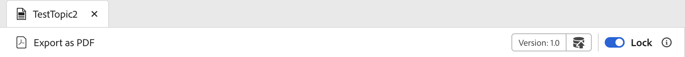
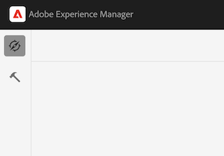

# 概要

古い UI から新しいAEM Guides UI に移行する際には、**ui_config** の更新をより柔軟なモジュール型 UI 設定に変換する必要があります。 このフレームワークは、変更を **editor_toolbar** および [other toolbar](/help/courses/course-3/conver-ui-config.md#editing-json-for-different-screens) にシームレスに導入するのに役立ちます。 このプロセスは、アプリケーション内の他のビューやウィジェットの変更もサポートしています。

>[!NOTE]
>
>特定のボタンに適用されるカスタマイズは、拡張機能フレームワークへの移行中に問題が発生する場合があります。 この場合、このページを参照してサポートチケットを発行すると、迅速なサポートと解決が可能になります。

## 様々な画面での JSON の編集

様々な画面やウィジェット用に、JSON ファイルを XML エディター UI 設定セクションに追加できます。 広く使用されているウィジェットとその ID のリストを以下に示します。

1. [editor_toolbar](assets/toolbars/editor_toolbar.json): ファイルアクションとコンテンツアクションで構成される webeditor ツールバー。
1. [editor_tab_bar](assets/toolbars/editor_tab_bar.json): webeditor 内の開いているファイルのタブ付きビューには、開いているファイルに対して実行できるアクションがあります。
1. [file_mode_switcher](assets/toolbars/file_mode_switcher.json):webeditor 内で開いたファイルに対して、使用可能な様々なモード（オーサー、ソース、プレビュー）を切り替えるのに役立ちます。

   

1. [map_console_navigation_bar](assets/toolbars/map_console_navigation_bar.json): マップコンソールで開くマップの情報バーです。 マップを変更したり、設定にアクセスしたりできます。
1. [map_console_action_bar](assets/toolbars/map_console_action_bar.json)：出力プリセット、ベースライン、翻訳、レポートなどのマップコンソール項目のアクションバーで、関連情報とそれぞれのアクションボタンを提供します。

   

1. [home_navigation_bar](assets/toolbars/home_navigation_bar.json): ガイドのホームページのヘッダーバー。ウェルカムメッセージが選択したフォルダープロファイルと共に表示されます。

   

<br>

## 各 JSON の一般的な構造

各 JSON は、一貫した構造に従います。

1. `id`: コンポーネントをカスタマイズしているウィジェットを指定します。
1. `targetEditor`：エディターとモードのプロパティを使用して、ボタンを表示または非表示にするタイミングを定義します。

   `targetEditor` では、次のオプションがサポートされています。

   - `mode`
   - `displayMode`
   - `editor`
   - `documentType`
   - `documentSubType`
   - `flag`

   詳細については、「targetEditor プロパティについて [ を参照してください ](#understanding-targeteditor-properties)

   >[!NOTE]
   >
   > Experience Manager Guidesの 2506 リリースでは、`displayMode`、`documentType`、`documentSubType`、`flag` という新しいプロパティが導入されています。 これらのプロパティは、バージョン 2506 以降でのみサポートされます。 同様に、mode プロパティでの `toc` から `layout` への変更も、このリリース以降に適用されます。
   >
   > 既存の `editor` フィールドと共に、新しいフィールド `documentType` を使用できるようになりました。  両方のフィールドがサポートされており、必要に応じて使用できます。 ただし、実装間の一貫性を確保するために、特に `documentSubType` プロパティを使用する場合は、`documentType` を使用することをお勧めします。 `editor` フィールドは、後方互換性と既存の統合をサポートするために引き続き有効です。


1. `target`：新しいコンポーネントの追加先を指定します。 一意の識別にキーと値のペアまたはインデックスを使用します。 ビューの状態は次のとおりです。

   - **追加**：最後にを追加します。

   - **prepend**：先頭にを追加します。

   - **置換**：既存のコンポーネントを置換します。

JSON 構造の例：

```json
{
  "id" : "editor_toolbar",
  "view": {
    "items": [
      {
        ...,
        "targetEditor": {
          "mode": [
            "preview"
          ],
          "editor": [
            "xml"
          ]
        },
        "target": {
          "key": "label",
          "value": "Table",
          "viewState": "prepend"
        },
        ...
      },
    ]
  }
}
```

<br>

## `targetEditor` プロパティについて

各プロパティの分類、目的、サポートされている値を次に示します。

### `mode`

エディターの操作モードを定義します。

**サポートされている値**:`author`、`source`、`preview`、`layout` （以前は `toc`）、`split`

### `displayMode` *（オプション）*

UI コンポーネントの表示またはインタラクティブ機能をコントロールします。 指定しない場合、デフォルト値は `show` に設定されます。

**サポートされている値**:`show`、`hide`、`enabled`、`disabled`

例：

```
 {
        "icon": "textBulleted",
        "title": "Custom Insert Bulleted",
        "on-click": "$$AUTHOR_INSERT_REMOVE_BULLETED_LIST",
        "key": "$$AUTHOR_INSERT_REMOVE_BULLETED_LIST",
        "targetEditor": {
          "documentType": [
            "ditamap"
          ],
          "mode": [
            "author"
          ],
          "displayMode": "hide"
        }
      },
```

### `editor`

エディターでプライマリドキュメントタイプを指定します。

**サポートされている値**:`ditamap`、`bookmap`、`subjectScheme`、`xml`、`css`、`translation`、`preset`、`pdf_preset`

### `documentType`

プライマリドキュメントタイプを示します。

**サポートされている値**:`dita`、`ditamap`、`bookmap`、`subjectScheme`、`css`、`preset`、`ditaval`、`reports`、`baseline`、`translation`、`html`、`markdown`、`conditionPresets`

> 特定の使用例では、追加の値がサポートされている場合があります。

例：

```
 {
        "icon": "textNumbered",
        "title": "Custom Numbered List",
        "on-click": "$$AUTHOR_INSERT_REMOVE_NUMBERED_LIST",
        "key": "$$AUTHOR_INSERT_REMOVE_NUMBERED_LIST",
        "targetEditor": {
          "documentType": [
            "dita",
            "ditamap"
          ],
          "mode": [
            "author",
            "source"
          ]

        }
      },
```

### `documentSubType`

`documentType` に基づいてドキュメントをさらに分類します。

- **`preset`**:`pdf`、`html5`、`aemsite`、`nativePDF`、`json`、`custom`、`kb`
- **`dita`**:`topic`、`reference`、`concept`、`glossary`、`task`、`troubleshooting`

> 特定の使用例では、追加の値がサポートされている場合があります。

例：

```
 {
        "icon": "rename",
        "title": "Custom Rename",
        "on-click": "$$PUBLISH_PRESETS_RENAME",
        "label": "Custom Rename",
        "key": "$$PUBLISH_PRESETS_RENAME",
        "targetEditor": {
          "documentType": [
            "preset"
          ],
          "documentSubType": [
            "nativePDF",
            "aemsite",
            "json"
          ]

        }
      },
```

### `flag`

ドキュメントの状態または機能のブール値インジケーター。

**サポートされている値**:`isOutputGenerated`、`isTemporaryFileDownloadable`、`isPDFDownloadable`、`isLocked`、`isUnlocked`、`isDocumentOpen`

さらに、`targetEditor` でフラグとして利用されるカスタムフラグを `extensionMap` 内に作成することもできます。 ここで、`extensionMap` はカスタムキーまたは観察可能な値を追加するために使用されるグローバル変数です。

例：

```
 {
        "icon": "filePDF",
        "title": "Custom Export pdf",
        "on-click": "$$DOWNLOAD_TOPIC_PDF",
        "key": "$$DOWNLOAD_TOPIC_PDF",
        "targetEditor": {
          "documentType": [
            "markdown"
          ],
          "mode": [
            "preview"
          ],
          "flag": ["isPDFDownloadable"]

        }
      },
```


## 例

次に、エディターツールバーでボタンを追加、削除、置換する方法の例を示します。

### ボタンの追加

**editor_toolbar** に新しいボタン **Insert Custom Table** を追加して、プレビューモードでのみ表示される単純なテーブルを追加します。

```json
{
  "id": "editor_toolbar",
  "view": {
    "items": [
      {
        "icon": "table",
        "title": "Insert Custom Table",
        "on-click": {
          "name": "$$AUTHOR_INSERT_ELEMENT",
          "args": [
            "simpletable",
            "table",
            "choicetable"
          ]
        },
        "key": "$$AUTHOR_INSERT_ELEMENT",
        "targetEditor": {
          "mode": [
            "preview"
          ],
        },
        "target": {
          "key": "label",
          "value": "Table",
          "viewState": "prepend"
        }
      }
    ]
  }
}
```


### ボタンの削除

ツールバーからボタンを削除する。 ここでは、エディターツールバーから「画像を追加」ボタンを削除します。

```json
{
  "id": "editor_toolbar",
  "view": {
    "items": [
      {
        "hide": true,
        "target": {
          "key": "label",
          "value": "Image",
          "viewState": "replace"
        }
      }
    ]
  }
}
```

### ボタンの置き換え

ツールバーの **マルチメディア** ボタンを、オーサーモードでのみ表示される **Youtube** リンク挿入ボタンに置き換えます。

```json
{
  "id": "editor_toolbar",
  "view": {
    "items": [
      {
        "icon": "s2youtube",
        "title": "Youtube",
        "on-click": {
          "name": "$$AUTHOR_INSERT_ELEMENT",
          "args": "<object data='http://youtube.com'></object>"
        },
        "targetEditor": {
          "mode": [
            "author"
          ]
        },
        "target": {
          "key": "elementId",
          "value": "toolbar-multimedia",
          "viewState": "replace"
        }
      }
    ]
  }
}
```


<br>

### プレビューモードでのボタンの追加

設計に従って、ボタンの表示はロックとロック解除（読み取り専用）モードで個別に管理され、明確で制御されたユーザーエクスペリエンスを維持します。 デフォルトでは、インターフェイスが読み取り専用モードの場合、新しく追加されたボタンは非表示になります。
ボタンを **読み取り専用** モードで表示するには、インターフェイスがロックされていてもアクセス可能なツールバーサブセクション内にボタンを配置するターゲットを指定する必要があります。
例えば、ターゲットを「**PDFとしてダウンロード**」として指定すると、ボタンが既存の表示可能なボタンと同じセクションに表示され、ロックが解除された状態でアクセスできるようになります。

```json
"target": {
  "key": "label",
  "value": "Download as PDF",
  "viewState": "prepend"
}
```

**プレビュー** モードで「**PDFとして書き出し** ボタンを追加すると、ロックモードとアンロックモードの両方で表示されます。

```json
{
  "id": "editor_toolbar",
  "view": {
    "items": [
      {
        "icon": "filePDF",
        "title": "Export as PDF",
        "on-click": "$$DOWNLOAD_TOPIC_PDF",
        "key": "$$DOWNLOAD_TOPIC_PDF",
        "targetEditor": {
          "editor": [
            "ditamap",
            "xml"
          ],
          "mode": [
            "preview"
          ]
        },
        "target": {
          "key": "label",
          "value": "Download as PDF",
          "viewState": "prepend"
        }
      },
      {
        "icon": "filePDF",
        "title": "Export as PDF",
        "on-click": "$$DOWNLOAD_TOPIC_PDF",
        "key": "$$DOWNLOAD_TOPIC_PDF",
        "targetEditor": {
          "editor": [
            "ditamap",
            "xml"
          ],
          "mode": [
            "preview"
          ]
        }
      }
    ]
  }
}
```

次のスニペットは、ロックのシナリオを使用した **PDFとして書き出し** ボタンを示しています。



また、ロック解除シナリオを含む **PDFとして書き出し** ボタンは、以下のスニペットで確認できます。


## カスタマイズされた JSON のアップロード方法

1. **XML エディター設定** タブの上部バーにある **編集** をクリックします。
1. **XML エディター UI 設定** サブセクションに「**アップロード** ボタンが表示されるようになりました。

   {width="400" height="150"}

1. 変更した json をクリックしてアップロードできます。 （アップロードする json は、カスタマイズするウィジェットの ID と同じ名前にする必要があります）
1. アップロードが完了したら、上部のバーの **保存** をクリックします。

   アップロードしたファイルごとに、JSON を **削除** して UI からカスタマイズを削除したり、**ダウンロード** して再び表示または変更したりすることもできます。

   {width="400" height="150"}

<br>


## カスタマイズした CSS のアップロード方法

また、css を追加して、カスタムで追加したボタンや、UI 上の既存のウィジェットまたはボタンのルックアンドフィールをカスタマイズすることもできます。

新しく追加されたカスタムボタンの場合は、JSON 内のカスタムボタンまたはコンポーネントに **extraclass** を追加します。
古いクラスでは、要素を検査し、既存のクラスも変更できます。

```json
{
  "icon": "table",
  "title": "Insert Custom Table",
  "extraclass": "custom-css",
  "key": "$$AUTHOR_INSERT_ELEMENT",
  "targetEditor": {
    "mode": [
      "preview"
    ],
  },
  "target": {
    "key": "label",
    "value": "Table",
    "viewState": "prepend"
  }
}
```

1. **XML エディター設定** タブの上部バーにある **編集** をクリックします。
1. **XML エディターのページレイアウト** サブセクションに「**アップロード** ボタンが表示されるようになりました。

   {width="400" height="150"}

1. をクリックして、変更した css をアップロードできます。 （css ファイルのみサポートされています）
1. アップロードが完了したら、上部のバーの **保存** をクリックします。

   アップロードしたファイルごとに、CSS を **削除** して UI からカスタマイズを削除したり、**ダウンロード** して再び表示または変更したりすることもできます。

   {width="400" height="150"}


<br>

### ボタン CSS のカスタマイズ例

ここでは、**editor_toolbar** に新しいボタン **Insert Custom Table** を追加して、プレビューモードでのみ表示されるシンプルなテーブルを追加し、そのテーブルにカスタム CSS を適用します。
この css は、ボタンの背景とタイトルのフォントサイズを変更します。


```css
#editor_toolbar {
  .custom-css {
    background-color: burlywood;
    font-size: 2rem;  
  }
}
```

```json
{
  "id": "editor_toolbar",
  "view": {
    "items": [
      {
        "icon": "table",
        "title": "Insert Custom Table",
        "extraclass": "custom-css",
        ...
      }
    ]
  }
}
```

<br>

## ui 設定をモジュール型 Json に変換する手順

1. ナビゲーション画面で、「[!UICONTROL **ツール**]」アイコンをクリックします。

   

1. 左側のパネルで「**ガイド**」を選択します。

1. [!UICONTROL **フォルダープロファイル**] タイルをクリックします。

   

1. フォルダープロファイルを選択します。

1. 「[!UICONTROL **XML エディター設定**]」タブをクリックします。

1. 「**UI 設定を JSON に変換**」ボタンをクリックできます。 これにより、**ui_config** で行われた変更を含む **editor_toolbar** と **map_console_action_bar** json が生成されます。

   

1. [ エディターツールバー ](assets/editor_toolbar.json) および [ マップコンソールのアクションバー用に、サンプルで生成されたジョブをチェックアウト ](assets/map_console_action_bar.json) きます。


>[!NOTE]
>
>**toolbar** セクションと **topbar** セクションに加えられた変更は、**editor_toolbar** json に追加され、エディターページに表示されます。 **ui_config** でプリセットまたは翻訳に関連するボタンに加えられた変更は、**map_console_action_bar** json に追加され、マップコンソールページに表示されます。
