# 概要

古いUIから新しいAEM Guides UIに移行する場合、**ui_config**&#x200B;への更新は、より柔軟でモジュール化されたUI設定に変換する必要があります。 このフレームワークは、**editor_toolbar**&#x200B;とその他[のツールバー](/help/courses/course-3/conver-ui-config.md#editing-json-for-different-screens)に変更をシームレスに適用するのに役立ちます。 このプロセスでは、アプリケーション内の他のビューやウィジェットの変更もサポートしています。

>[!NOTE]
>
>特定のボタンに適用されたカスタマイズは、拡張フレームワークへの移行中に問題が発生する場合があります。 このような場合は、このページを参照してサポートチケットを発行し、迅速なサポートと解決を行うことができます。

## 異なるスクリーン用のJSONの編集

JSON ファイルは、様々な画面やウィジェットのXML エディターのUI設定セクションに追加できます。 以下に、広く使用されているウィジェットとそのIDのリストを示します。

1. [editor_toolbar](assets/toolbars/editor_toolbar.json): ファイルとコンテンツのアクションで構成されるWebeditor ツールバー。
1. [editor_tab_bar](assets/toolbars/editor_tab_bar.json): webeditor内で開いているファイルのタブ付きビューには、開いているファイルに対して実行できるアクションがあります。
1. [file_mode_switcher](assets/toolbars/file_mode_switcher.json): webeditor内で開いているファイルに対して、様々な利用可能なモード（オーサー、ソース、プレビュー）を切り替えるのに役立ちます。

   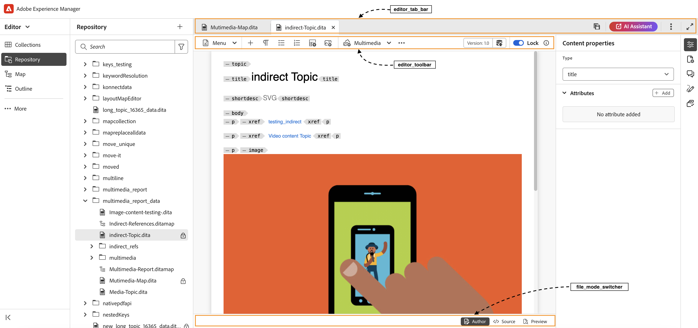

1. [map_console_navigation_bar](assets/toolbars/map_console_navigation_bar.json): マップコンソールで開くマップの情報バーです。 マップの変更が可能で、設定にアクセスできます。
1. [map_console_action_bar](assets/toolbars/map_console_action_bar.json)：これは、出力プリセット、ベースライン、翻訳、レポートなどのマップコンソール項目のアクションバーで、それぞれのアクションボタンと共に関連情報を提供します。

   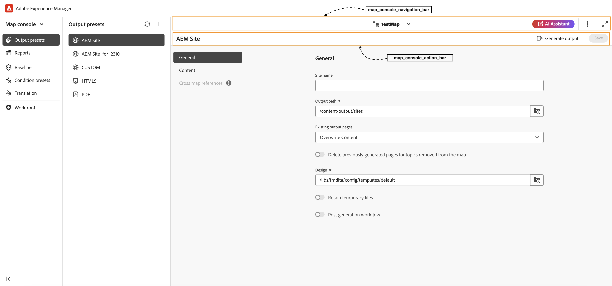

1. [home_navigation_bar](assets/toolbars/home_navigation_bar.json)：選択したフォルダープロファイルと共にウェルカムメッセージが表示されるGuides ホームページのヘッダーバー。

   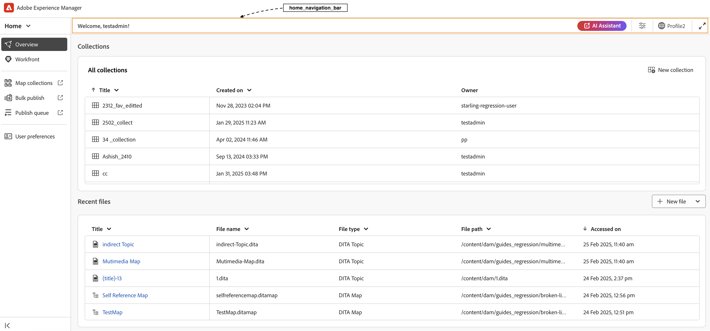

<br>

## 各JSONの一般的な構造

各JSONは、一貫した構造に従います。

1. `id`: コンポーネントをカスタマイズするウィジェットを指定します。
1. `targetEditor`: エディターとモードのプロパティを使用して、ボタンを表示または非表示にするタイミングを定義します。

   `targetEditor`では、次のオプションがサポートされています。

   - `mode`
   - `displayMode`
   - `editor`
   - `documentType`
   - `documentSubType`
   - `flag`

   詳細については、[TargetEditor プロパティについて](#understanding-targeteditor-properties)を参照してください

   >[!NOTE]
   >
   > Experience Manager Guides 2506 リリースでは、新しいプロパティ `displayMode`、`documentType`、`documentSubType`、`flag`が導入されています。 これらのプロパティは、バージョン 2506以降でのみサポートされています。 同様に、mode プロパティの`toc`から`layout`への変更も、このリリース以降に適用されます。
   >
   > 新しいフィールド `documentType`が、既存の`editor` フィールドと共に使用できるようになりました。  両方のフィールドがサポートされており、必要に応じて使用できます。 ただし、`documentSubType` プロパティを使用する場合は、実装全体の一貫性を確保するために、`documentType`を使用することをお勧めします。 下位互換性と既存の統合をサポートするために、`editor` フィールドは引き続き有効です。


1. `target`：新しいコンポーネントを追加する場所を指定します。 これは、一意の識別にキーと値のペアまたはインデックスを使用します。 ビューの状態は次のとおりです。

   - **追加**：最後に追加します。

   - **prepend**：先頭に追加します。

   - **replace**：既存のコンポーネントを置き換えます。

JSON構造の例：

```json
{
  "id" : "editor_toolbar",
  "view": {
    "items": [
      {
        ...,
        "targetEditor": {
          "mode": [
            "preview"
          ],
          "editor": [
            "xml"
          ]
        },
        "target": {
          "key": "label",
          "value": "Table",
          "viewState": "prepend"
        },
        ...
      },
    ]
  }
}
```

<br>

## `targetEditor` プロパティについて

以下に、各プロパティ、その目的、およびサポートされる値の内訳を示します。

### `mode`

エディターの動作モードを定義します。

**サポートされる値**: `author`、`source`、`preview`、`layout` （以前は`toc`）、`split`

### `displayMode` *（オプション）*

UI コンポーネントの表示またはインタラクティブ性を制御します。 指定しない場合、デフォルト値は`show`に設定されます。

**サポートされる値**: `show`、`hide`、`enabled`、`disabled`

例：

```
 {
        "icon": "textBulleted",
        "title": "Custom Insert Bulleted",
        "on-click": "$$AUTHOR_INSERT_REMOVE_BULLETED_LIST",
        "key": "$$AUTHOR_INSERT_REMOVE_BULLETED_LIST",
        "targetEditor": {
          "documentType": [
            "ditamap"
          ],
          "mode": [
            "author"
          ],
          "displayMode": "hide"
        }
      },
```

### `editor`

エディターでプライマリ文書タイプを指定します。

**サポートされる値**: `ditamap`、`bookmap`、`subjectScheme`、`xml`、`css`、`translation`、`preset`、`pdf_preset`

### `documentType`

プライマリ文書タイプを示します。

**サポートされる値**: `dita`、`ditamap`、`bookmap`、`subjectScheme`、`css`、`preset`、`ditaval`、`reports`、`baseline`、`translation`、`html`、`markdown`、`conditionPresets`

> 特定のユースケースでは、追加の値がサポートされる場合があります。

例：

```
 {
        "icon": "textNumbered",
        "title": "Custom Numbered List",
        "on-click": "$$AUTHOR_INSERT_REMOVE_NUMBERED_LIST",
        "key": "$$AUTHOR_INSERT_REMOVE_NUMBERED_LIST",
        "targetEditor": {
          "documentType": [
            "dita",
            "ditamap"
          ],
          "mode": [
            "author",
            "source"
          ]

        }
      },
```

### `documentSubType`

ドキュメントをさらに`documentType`に基づいて分類します。

- **`preset`**&#x200B;の場合：`pdf`、`html5`、`aemsite`、`nativePDF`、`json`、`custom`、`kb`
- **`dita`**&#x200B;の場合：`topic`、`reference`、`concept`、`glossary`、`task`、`troubleshooting`

> 特定のユースケースでは、追加の値がサポートされる場合があります。

例：

```
 {
        "icon": "rename",
        "title": "Custom Rename",
        "on-click": "$$PUBLISH_PRESETS_RENAME",
        "label": "Custom Rename",
        "key": "$$PUBLISH_PRESETS_RENAME",
        "targetEditor": {
          "documentType": [
            "preset"
          ],
          "documentSubType": [
            "nativePDF",
            "aemsite",
            "json"
          ]

        }
      },
```

### `flag`

ドキュメントの状態または機能のブール指標。

**サポートされる値**: `isOutputGenerated`、`isTemporaryFileDownloadable`、`isPDFDownloadable`、`isLocked`、`isUnlocked`、`isDocumentOpen`

さらに、`extensionMap`内にカスタムフラグを作成して、`targetEditor`でフラグとして使用することもできます。 ここでは、`extensionMap`は、カスタムキーまたは観測可能な値の追加に使用されるグローバル変数です。

例：

```
 {
        "icon": "filePDF",
        "title": "Custom Export pdf",
        "on-click": "$$DOWNLOAD_TOPIC_PDF",
        "key": "$$DOWNLOAD_TOPIC_PDF",
        "targetEditor": {
          "documentType": [
            "markdown"
          ],
          "mode": [
            "preview"
          ],
          "flag": ["isPDFDownloadable"]

        }
      },
```


## 例

次に、エディターツールバーのボタンを追加、削除、置換する方法の例を示します。

### ボタンの追加

新しいボタンを追加する&#x200B;**プレビューモードでのみ表示されるシンプルなテーブルを追加するには、** editor_toolbar **にカスタムテーブル**&#x200B;を挿入します。

```json
{
  "id": "editor_toolbar",
  "view": {
    "items": [
      {
        "icon": "table",
        "title": "Insert Custom Table",
        "on-click": {
          "name": "$$AUTHOR_INSERT_ELEMENT",
          "args": [
            "simpletable",
            "table",
            "choicetable"
          ]
        },
        "key": "$$AUTHOR_INSERT_ELEMENT",
        "targetEditor": {
          "mode": [
            "preview"
          ],
        },
        "target": {
          "key": "label",
          "value": "Table",
          "viewState": "prepend"
        }
      }
    ]
  }
}
```

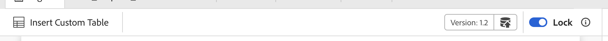

### ボタンの削除

ツールバーからボタンを削除します。 ここでは、エディターツールバーから「画像を追加」ボタンを削除します。

```json
{
  "id": "editor_toolbar",
  "view": {
    "items": [
      {
        "hide": true,
        "target": {
          "key": "label",
          "value": "Image",
          "viewState": "replace"
        }
      }
    ]
  }
}
```

### ボタンの置き換え

ツールバーの&#x200B;**マルチメディア** ボタンを、作成者モードでのみ表示される&#x200B;**Youtube** リンク挿入ボタンに置き換えます。

```json
{
  "id": "editor_toolbar",
  "view": {
    "items": [
      {
        "icon": "s2youtube",
        "title": "Youtube",
        "on-click": {
          "name": "$$AUTHOR_INSERT_ELEMENT",
          "args": "<object data='http://youtube.com'></object>"
        },
        "targetEditor": {
          "mode": [
            "author"
          ]
        },
        "target": {
          "key": "elementId",
          "value": "toolbar-multimedia",
          "viewState": "replace"
        }
      }
    ]
  }
}
```

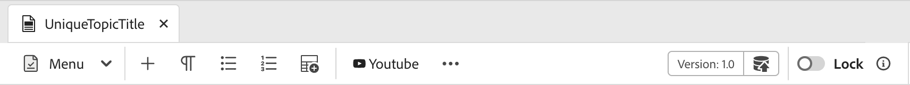

<br>

### プレビューモードでのボタンの追加

デザインに従って、ボタンの表示は、ロックおよびロック解除（読み取り専用）モードに対して個別に管理され、明確で制御されたユーザーエクスペリエンスを維持します。 デフォルトでは、インターフェイスが読み取り専用モードの場合、新しく追加されたボタンは非表示になります。
ボタンを&#x200B;**読み取り専用** モードで表示するには、インターフェイスがロックされていてもアクセス可能なツールバーサブセクション内にボタンを配置するターゲットを指定する必要があります。
例えば、ターゲットを&#x200B;**PDFとしてダウンロード**&#x200B;と指定することで、ボタンが既存の表示中のボタンと同じセクションに表示されるように設定し、ロック解除モードでアクセスできるようにすることができます。

```json
"target": {
  "key": "label",
  "value": "Download as PDF",
  "viewState": "prepend"
}
```

**Preview** モードでボタン **Export as PDF**&#x200B;を追加すると、ロック モードとロック解除モードの両方で表示されます。

```json
{
  "id": "editor_toolbar",
  "view": {
    "items": [
      {
        "icon": "filePDF",
        "title": "Export as PDF",
        "on-click": "$$DOWNLOAD_TOPIC_PDF",
        "key": "$$DOWNLOAD_TOPIC_PDF",
        "targetEditor": {
          "editor": [
            "ditamap",
            "xml"
          ],
          "mode": [
            "preview"
          ]
        },
        "target": {
          "key": "label",
          "value": "Download as PDF",
          "viewState": "prepend"
        }
      },
      {
        "icon": "filePDF",
        "title": "Export as PDF",
        "on-click": "$$DOWNLOAD_TOPIC_PDF",
        "key": "$$DOWNLOAD_TOPIC_PDF",
        "targetEditor": {
          "editor": [
            "ditamap",
            "xml"
          ],
          "mode": [
            "preview"
          ]
        }
      }
    ]
  }
}
```

次のスニペットは、「**PDFとして書き出し**」ボタンとロックシナリオを示しています。

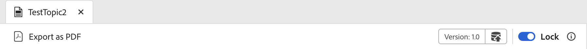

また、「**PDFとして書き出し**」ボタンは、下のスニペットに表示されます。

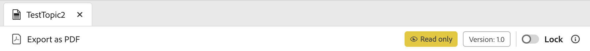

### エディターツールバーのメニュードロップダウンに表示されるオプションをカスタマイズします

次の例を使用して、メニュードロップダウンでカスタムオプションを追加、非表示、置換、追加できます。

#### 追加中

メニュードロップダウンにオプションを追加します。 ここでは、メニューオプションに&#x200B;**カスタムメニューボタン**&#x200B;を追加します

```json
{
        "icon": "specialCharacter",
        "title": "Custom menu button",
        "on-click": "$$AUTHOR_INSERT_SYMBOL",
        "targetEditor": {
          "editor": [
            "ditamap"
          ],
          "mode": [
            "author"
          ]
        },
        "target": {
          "key": "label",
          "value": "Version label",
          "viewState": "append"
        }
      }
```

#### 置換

メニュードロップダウンに表示されるオプションの置き換え。 ここでは、**レビュータスクの作成**&#x200B;を&#x200B;**カスタムメニューボタン 3**&#x200B;に置き換えています。

```json
{
        "icon": "specialCharacter",
        "title": "Custom menu button 3",
        "on-click": "$$AUTHOR_INSERT_SYMBOL",
        "target": {
          "key": "label",
          "value": "Create review task",
          "viewState": "replace"
        }

      }
```

#### 非表示

メニュードロップダウンに表示されるオプションを非表示にする。 ここでは、メニューから&#x200B;**検索と置換** オプションを非表示にしています。

```json
{
        "hide": true,
        "target": {
          "key": "label",
          "value": "Find and replace",
          "viewState": "replace"
        }
      }
```

#### サブメニューでのカスタムオプションの追加

メニュードロップダウン内のサブメニューにオプションを追加します。

```json
{
        "icon": "viewAllTags",
        "title": "Toggle Tags View Goziamasu",
        "key": "AUTHOR_TOGGLE_TAG_VIEW",
        "target": {
          "key": "label",
          "value": "Track changes",
          "viewState": "replace"
        },
        "targetEditor": {
          "documentType": [
            "dita"
          ],
          "mode": [
            "author"
          ]
        }

      }
```

## カスタマイズしたJSONのアップロード方法

1. 「**XML エディター設定**」タブで、トップバーの「**編集**」をクリックします。
1. これで、**XML エディターのUI設定** サブセクションに、**アップロード** ボタンが表示されるようになります。

   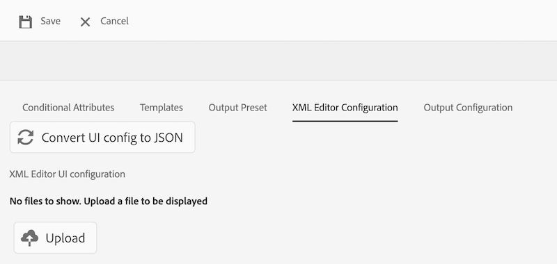{width="400" height="150"}

1. 変更したjsonをクリックしてアップロードできます。 （アップロードするjsonは、カスタマイズするウィジェットのIDと同じ名前にする必要があります）
1. アップロードが完了したら、トップバーで「**保存**」をクリックします。

   アップロードされたファイルごとに、**jsonを削除**&#x200B;してUIからカスタマイズを削除するか、**ダウンロード**&#x200B;して再度表示または変更することもできます。

   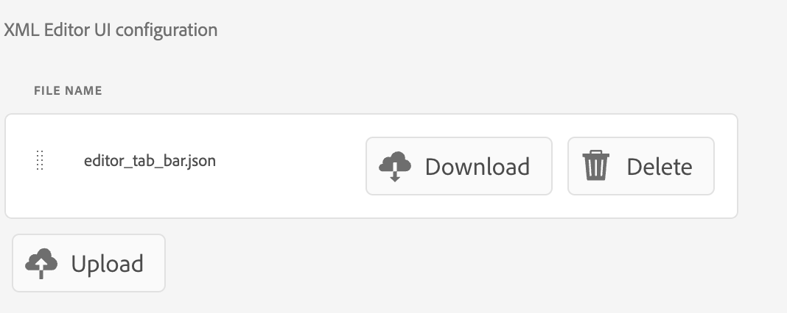{width="400" height="150"}

<br>


## カスタマイズしたCSSのアップロード方法

CSSを追加して、カスタム追加されたボタンや、UI上の既存のウィジェットまたはボタンのルックアンドフィールをカスタマイズすることもできます。

新しく追加されたカスタムボタンの場合は、JSON内のカスタムボタンまたはコンポーネントに&#x200B;**エクストラクラス**&#x200B;を追加します。
古いクラスの場合は、要素を調べて既存のクラスを修正することもできます。

```json
{
  "icon": "table",
  "title": "Insert Custom Table",
  "extraclass": "custom-css",
  "key": "$$AUTHOR_INSERT_ELEMENT",
  "targetEditor": {
    "mode": [
      "preview"
    ],
  },
  "target": {
    "key": "label",
    "value": "Table",
    "viewState": "prepend"
  }
}
```

1. 「**XML エディター設定**」タブで、トップバーの「**編集**」をクリックします。
1. これで、**XML エディターのページレイアウト** サブセクションに、**アップロード** ボタンが表示されるようになります。

   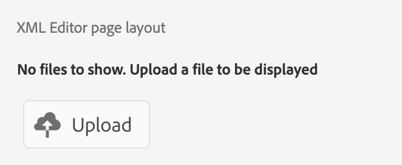{width="400" height="150"}

1. 変更したCSSをクリックしてアップロードできます。 （Css ファイルのみがサポートされています）
1. アップロードが完了したら、トップバーで「**保存**」をクリックします。

   アップロードされたファイルごとに、**削除** CSSを使用してUIからカスタマイズを削除するか、**ダウンロード**&#x200B;して再度表示または変更することもできます。

   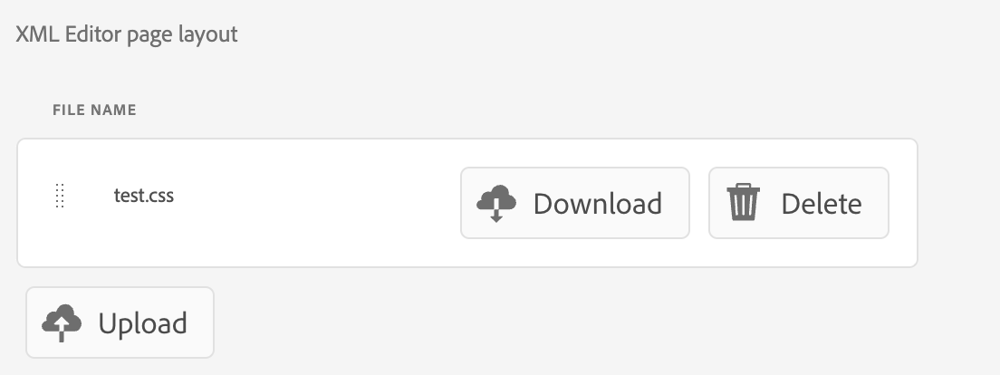{width="400" height="150"}


<br>

### ボタン cssをカスタマイズする例

ここでは、**editor_toolbar**&#x200B;に新しいボタン「**カスタムテーブルを挿入**」を追加して、プレビューモードでのみ表示されるシンプルなテーブルを追加し、そのテーブルにカスタム cssを適用します。
このCssは、ボタンの背景とタイトルのフォントサイズを変更します。

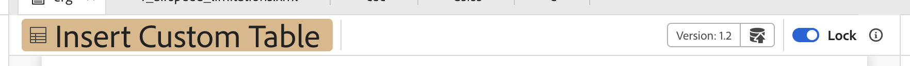


```css
#editor_toolbar {
  .custom-css {
    background-color: burlywood;
    font-size: 2rem;  
  }
}
```

```json
{
  "id": "editor_toolbar",
  "view": {
    "items": [
      {
        "icon": "table",
        "title": "Insert Custom Table",
        "extraclass": "custom-css",
        ...
      }
    ]
  }
}
```

<br>

## UI設定をモジュラーJsonに変換する手順

1. ナビゲーション画面で、[!UICONTROL **ツール**] アイコンをクリックします。

   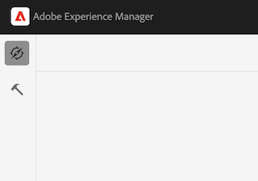

1. 左側のパネルで「**ガイド**」を選択します。

1. 「[!UICONTROL **フォルダープロファイル**]」タイルをクリックします。

   

1. フォルダープロファイルを選択します。

1. 「[!UICONTROL **XML エディター設定**]」タブをクリックします。

1. 「**UI設定をJSON**&#x200B;に変換」ボタンをクリックします。 これにより、**ui_config**&#x200B;で行われた変更を含む&#x200B;**editor_toolbar**&#x200B;および&#x200B;**map_console_action_bar**&#x200B;のjsonが生成されます。

   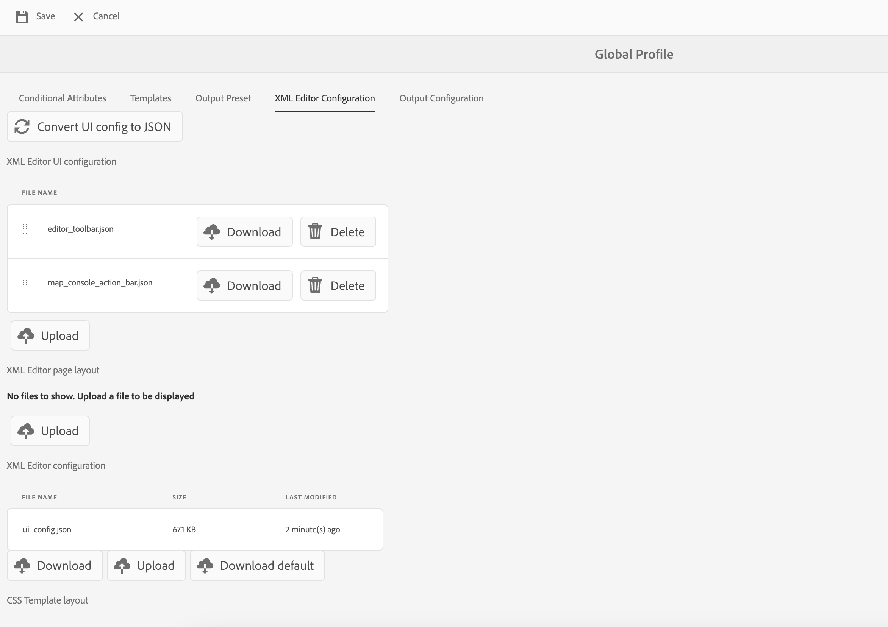

1. [&#x200B; エディターツールバー](assets/editor_toolbar.json)および[&#x200B; コンソールアクションバー](assets/map_console_action_bar.json)のサンプル生成されたJSONをチェックアウトできます


>[!NOTE]
>
>**ツールバー**&#x200B;および&#x200B;**トップバー**&#x200B;のセクションに加えられた変更は、**エディター_ツールバー** jsonに追加され、エディターページに表示されます。 **ui_config**&#x200B;のプリセットまたは翻訳に関連するボタンに加えられた変更は、**map_console_action_bar** jsonに追加され、Map Console ページに表示されます。
